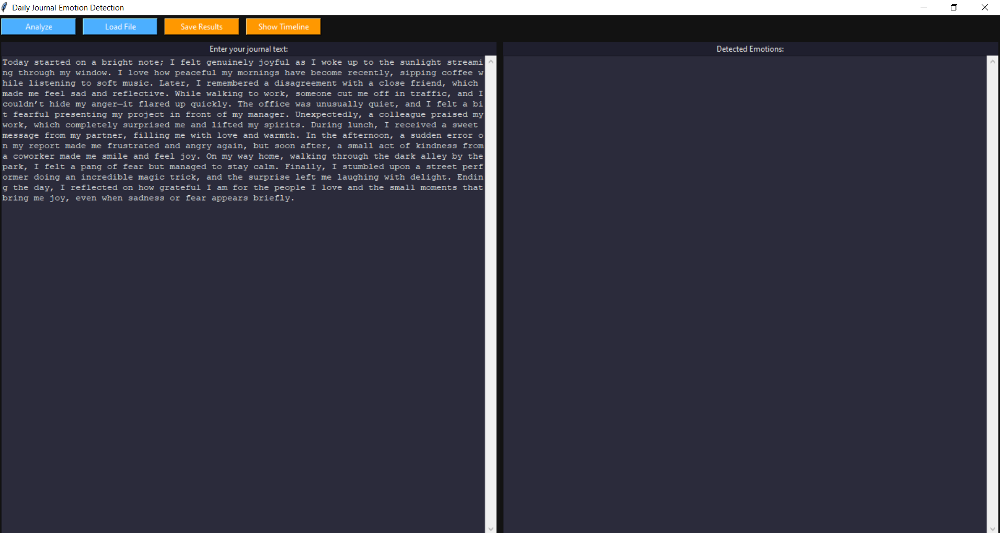
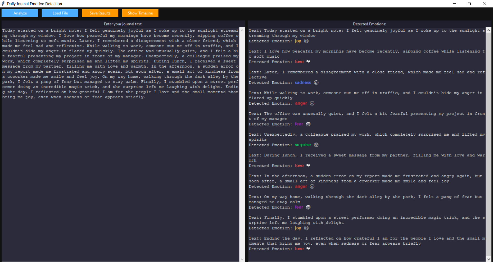
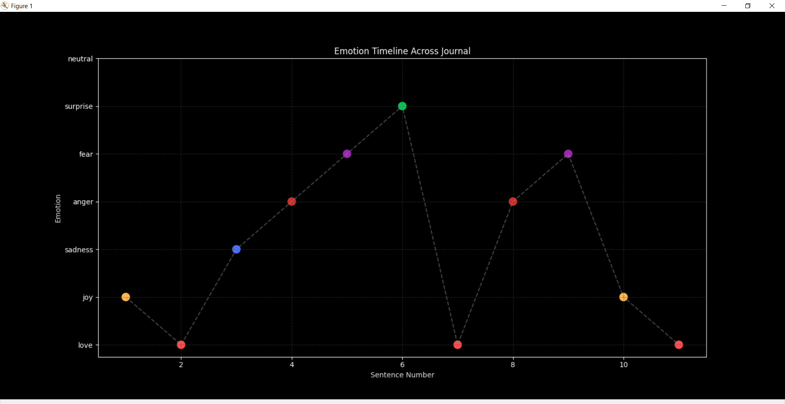

# Emotion Journal Analyzer

An AI-powered desktop application that analyzes journal entries and detects emotions using Hugging Face Transformers.

## Features

* Emotion Detection using Transformer Models
* Journal Writing Interface
* CSV Export and Import
* Emotion Timeline Visualization
* Dark Theme User Interface
* Multi-Emotion Recognition
* Interactive Data Analysis

## Technologies Used

* Python
* Tkinter
* Hugging Face Transformers
* Datasets Library
* Pandas
* Matplotlib

## Supported Emotions

* Joy 😊
* Love ❤️
* Sadness 😢
* Anger 😡
* Fear 😨
* Surprise 😲
* Neutral 😐

## Screenshots

### Home Screen

### Journal Editor

### Emotion Detection Results

### Timeline Visualization

## Installation

pip install -r requirements.txt

python main.py

## Future Improvements

* User Accounts
* Emotion Trend Analytics
* PDF Report Export
* Cloud Synchronization
* Multi-Language Support

